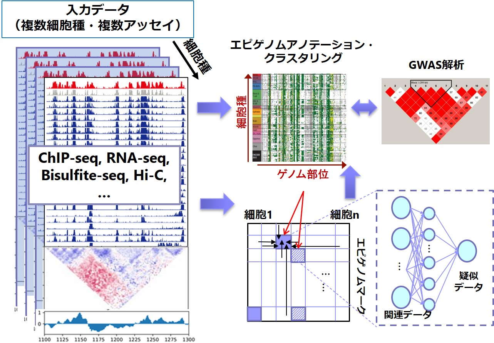

Title: 頑健なデータ駆動形エピゲノム解析を実現する情報解析システムの構築
Date: 2020-12-14 22:00
Summary: AMED-PRIME「頑健なデータ駆動形エピゲノム解析を実現する情報解析システムの構築」TOPPAGE
Template: Homepage
save_as: index.html

### 概要

　AMED-PRIME「早期ライフステージ」において、多細胞種・多サンプルを同時入力可能なエピゲノム比較解析システムを開発しています（図1）。本プロジェクトでは、ChIP-seq, RNA-seq, Hi-CなどさまざまなNGSアッセイを複数の細胞種（または細胞状態）から取得した大規模データを横断的に解析し、半教師あり学習を用いてクロマチン状態を詳細に注釈づけ（アノテーション）する手法を開発します。また、機械学習によるデータ補完技術を用いたエピゲノムデータの再構築手法を実現し、低品質・欠損データを含む大規模データから信頼性高く情報を抽出するための仕組みを構築します。 本システムが完成すれば、大規模解析のためのデータ生成コスト、解析コスト両面を大きく低減することが可能となり、生命系・医療系研究の飛躍的な推進が期待できます。ひいては、エピゲノム解析そのものの価値を飛躍的に高めることになります。 

開発するシステムを用いてAMED内共同研究を積極的に推進し、早期ライフステージに関する知見獲得に貢献します。また、本プロジェクトの一貫として[国際ヒトエピゲノムコンソーシアム (IHEC)](http://ihec-epigenomes.org/) にも参加しており、世界各国の情報解析の専門家と交流・議論しながら、大規模データ統合解析のためのアプローチを模索していきます。 

参考：

- [AMED「健康・医療の向上に向けた早期ライフステージにおける生命現象の解明」](https://www.amed.go.jp/program/list/16/02/001_13.html)
-  [頑健なデータ駆動形エピゲノム解析を実現する情報解析システムの構築](https://amedprime-nakatolab.github.io/)

図1: データ駆動形エピゲノム解析システムの概要 

