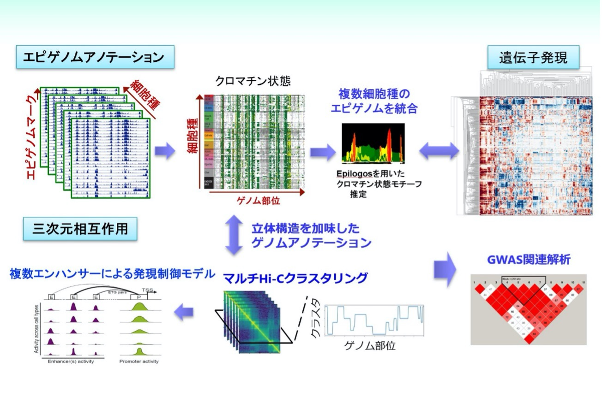

Title: 提案するデータ駆動型エピゲノム解析システムについて
Date: 2021-12-16 22:00
Category: システム概要
Tags: システム概要
Summary: システム概要
Template: page_before

<!--
見出しをサイドバーつけてスクロールできるようにしたい。（週末）
https://bootstrapious.com/p/bootstrap-sidebar

見出しごとの内容でページが分かれて見えるように、見出しのスタイルも変えると見やすいと思う。（週末）
-->

## 概要

私たちのグループは次世代シーケンサ（Next-Generation Sequencing, NGS）を用いたゲノム・エピゲノム情報解析を専門としており、そのための新規解析手法の開発と、それらを用いた知見獲得に一貫して取り組んでいます。AMED-PRIME「早期ライフステージ」においては、領域が目指す「早期ライフステージにおける環境刺激が成人期以降の健康に影響を与えるメカニズムの解明」に資するべく、以下に示す種々のNGS解析を統合したデータ駆動形エピゲノム解析システムを構築します。本システムを用いた領域内共同研究による貢献も目指していますので、解析でお困りの方はお気軽にご連絡ください。

図1: データ駆動形エピゲノム解析システムの概要 

## エピゲノムアノテーション

ヒストン修飾のChIP-seq及びDNAメチル化データを用いて、ゲノム領域を種々の「クロマチン状態（プロモーター、エンハンサーなど）」に分類します。複数の細胞種間でのクロマチン状態の保存性・多様性を比較する他、IHECデータベースに登録されている多種細胞のエピゲノムデータをもとに機械学習を用いてエピゲノム状態・遺伝子発現状態を予測するようなアプローチも構築していく予定です。 

参考：

- Nakato R, Sakata T, 
  [Methods for ChIP-seq analysis: A practical workflow and advanced applications](https://www.sciencedirect.com/science/article/pii/S1046202320300591)
  *Methods*, vol. 187, 44-53, 2020.
- Nakato R, Shirahige K, 
  [Recent advances in ChIP-seq analysis: from quality management to whole-genome annotation](https://academic.oup.com/bib/article/18/2/279/2453282/Recent-advances-in-ChIP-seq-analysis-from-quality) 
  *Briefings in Bioinformatics*, vol. 18, issue 2, 279-290, 2017.

## 遺伝子発現

RNA-seq及びそれに類似のNGSアッセイを用いて細胞内の遺伝子発現を網羅的に解析します。1細胞発現量解析（scRNA-seq）も可能です。 

 

参考：

- Nakajima N, Hayashi T, Fujiki K, Shirahige K, Akiyama T, Akutsu T, Nakato R,  
  [Codependency and mutual exclusivity for gene community detection from sparse single-cell transcriptome data](https://academic.oup.com/nar/advance-article/doi/10.1093/nar/gkab601/6324613)
  *Nucleic Acids Research*, vol. 49, issue 18, e104, 2021.

## 三次元相互作用

Hi-C, Micro-C, Hi-ChIP, ChIA-PETなど、ゲノム立体構造を観察するためのNGSアッセイは数多くあります。これらの手法を用いて、エンハンサープロモーター相互作用、TADと呼ばれる構造単位、コンパートメント構造などを解析可能です。アッセイごとに得意分野が異なりますので、目的に応じて手法を選択する必要があります。また、立体構造データをヒストン修飾ChIP-seqと統合してクロマチン状態推定に用いる手法も開発しました。 

参考：

- Wang J, Nakato R,  
  [HiC1Dmetrics: framework to extract various one-dimensional features from chromosome structure data](https://academic.oup.com/bib/advance-article/doi/10.1093/bib/bbab509/6446983)
  *Briefings in Bioinformatics*, bbab509, 2021.
- Shinkai S, Onami S, Nakato R,  
  [Toward understanding the dynamic state of 3D genome](https://www.sciencedirect.com/science/article/pii/S2001037020303676)
  *Computational and Structural Biotechnology Journal*, vol. 18, 2259-2269, 2020.

## GWAS関連解析

一連の解析で得られた興味のあるゲノム部位や遺伝子群に対し、既知の疾患関連ゲノム変異部位 (genome-wide association study, **GWAS**)との関連があるかを解析します。 

参考：

- Nakato R, Wada Y, Nakaki R, Nagae G et al.,  
  [Comprehensive epigenome characterization reveals diverse transcriptional regulation across human vascular endothelial cells](https://epigeneticsandchromatin.biomedcentral.com/articles/10.1186/s13072-019-0319-0)
  *Epigenetics & Chromatin*, vol. 12, issue 1, 77, 2019.

## その他

他にも遺伝子ネットワーク解析などの手法を開発しており、開発した手法は本ページに掲載される予定です。 

